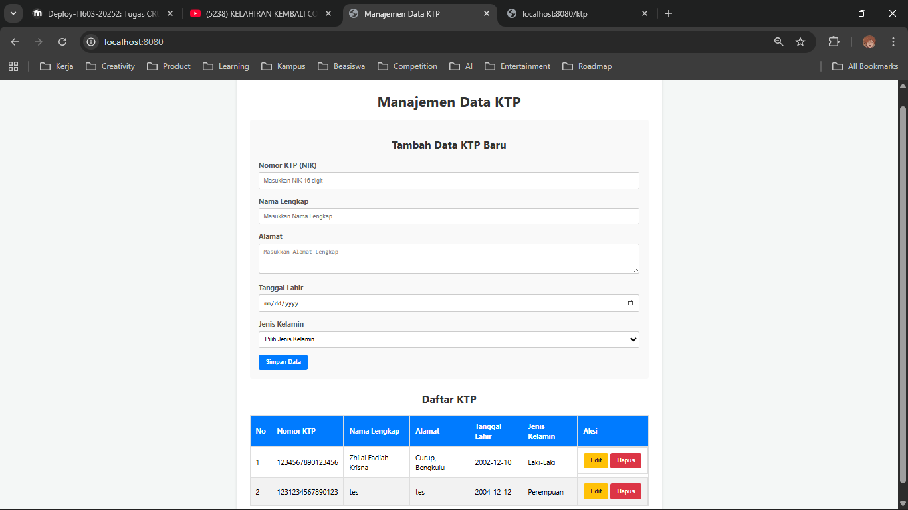
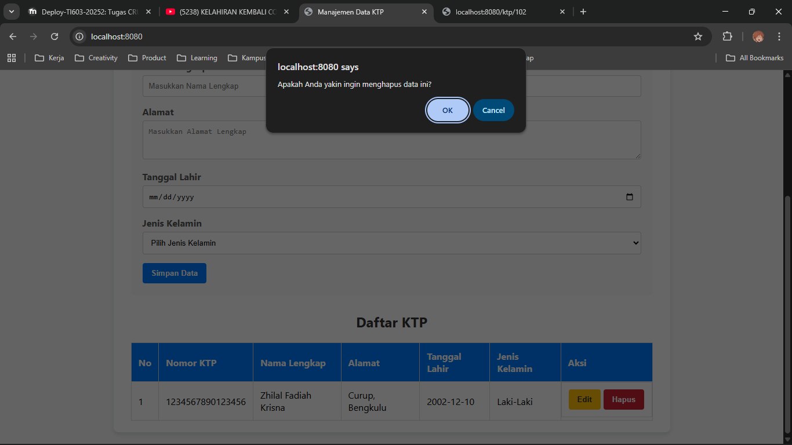
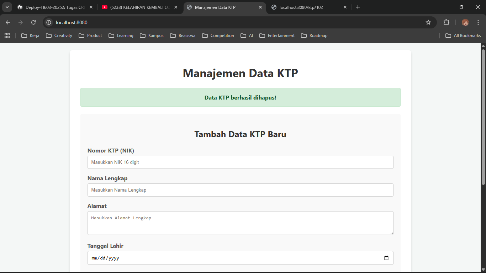
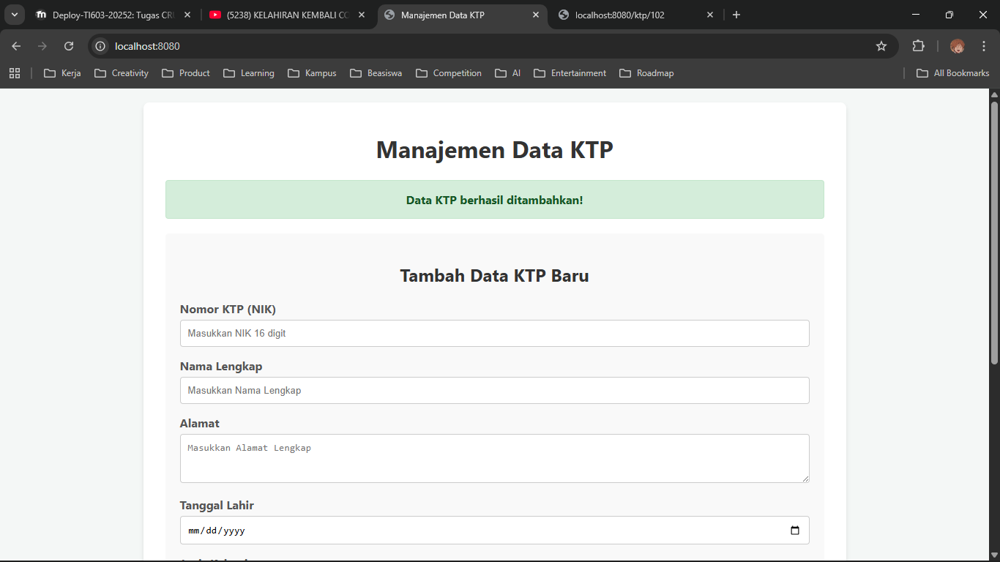
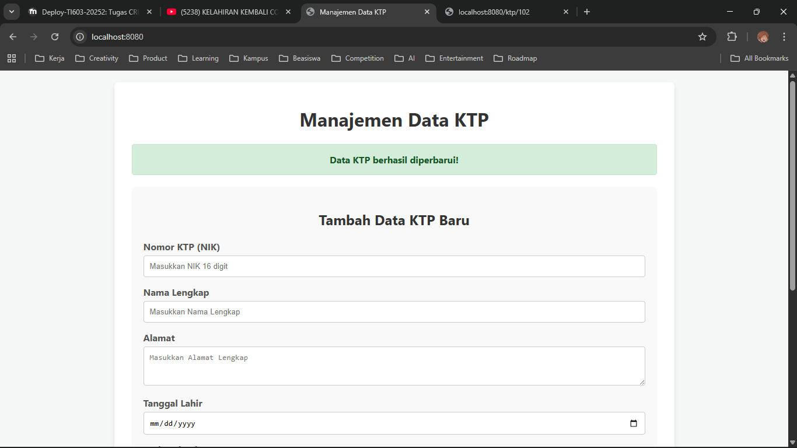

# Praktikum 2 Deployment Perangkat Lunak

## Tampilan Website


## API Documentation
### POST
Endpoint:  
`/ktp`  

Response:  
```
{
    "data": {
        "alamat": "Tes",
        "id": 102,
        "jenisKelamin": "Perempuan",
        "namaLengkap": "Tes",
        "nomorKtp": "1234567898765456",
        "tanggalLahir": "2012-12-12"
    },
    "status": "success"
}
```

### GET
#### GetAll
Endpoint:  
`/ktp`

Response:  
```
{
    "data": [
        {
            "alamat": "Curup, Bengkulu",
            "id": 1,
            "jenisKelamin": "Laki-Laki",
            "namaLengkap": "Zhilal Fadiah Krisna",
            "nomorKtp": "1234567890123456",
            "tanggalLahir": "2002-12-10"
        },
        {
            "alamat": "Tes",
            "id": 102,
            "jenisKelamin": "Perempuan",
            "namaLengkap": "Tes",
            "nomorKtp": "1234567898765456",
            "tanggalLahir": "2012-12-12"
        }
    ],
    "status": "success"
}
```

#### GetById
Endpoint:  
`/ktp/{id}`

Response:
```
{
  "data": {
    "alamat": "Tes",
    "id": 102,
    "jenisKelamin": "Perempuan",
    "namaLengkap": "Tes",
    "nomorKtp": "1234567898765456",
    "tanggalLahir": "2012-12-12"
  },
  "status": "success"
}
```

### PUT
Endpoint:  
`/ktp/{id}`

Response:  
```
{
    "data": {
        "alamat": "Tes",
        "id": 102,
        "jenisKelamin": "Perempuan",
        "namaLengkap": "TesUpdate",
        "nomorKtp": "1234567898765456",
        "tanggalLahir": "2012-12-12"
    },
    "status": "success"
}
```

### DELETE
Endpoint:  
`/ktp/{id}`

Response:  
```
{"status":"success deleted ktp with id 52"}
```

## Notifikasi
### Notifikasi Delete



### Notifikasi Create


### Notifikasi Update
